[← Back to the README](../README.md)

# Reference

## The Run at a Glance

Everything cheap happens first, so a run that has nothing to do costs a couple of minutes rather than an hour. Amber is a decision, red stops the run, green finishes it.

```mermaid
flowchart TD
    classDef gate fill:#fff4ce,stroke:#c19c00,color:#201f1e
    classDef stop fill:#fde7e9,stroke:#c50f1f,color:#201f1e
    classDef done fill:#dff6dd,stroke:#107c10,color:#201f1e
    classDef work fill:#e5f1fb,stroke:#0f6cbd,color:#201f1e

    Start(["Windows-ISO-Updater.ps1"]) --> Admin{"Elevated, on Windows 10 or later?"}
    Admin -- "no" --> Halt1["Relaunch elevated, or stop"]
    Admin -- "yes" --> Sched{"-RegisterScheduledTask?"}
    Sched -- "yes" --> Task["Register or remove the task, exit 0"]
    Sched -- "no" --> Mutex{"Another run holding this work folder?"}
    Mutex -- "yes" --> Halt2["Stop, one run per work folder"]

    subgraph Preflight ["Pre-flight, nothing downloaded yet"]
        Sweep["Sweep an interrupted run, discard stale DISM mounts"] --> Disk{"50 GB free on the work drive?"}
        Disk -- "no" --> Halt3["Stop, pick a bigger drive with -WorkPath"]
        Disk -- "yes" --> Output{"Output folder reachable and writable?"}
        Output -- "no" --> Halt6["Stop, the finished ISO would have nowhere to go"]
        Output -- "yes" --> Validate["Validate -UnattendPath, -DriverPath and -ExtraFilesPath, parsed and never executed"]
        Validate --> Confirm{"Confirmed, or -Force?"}
        Confirm -- "no" --> Halt4["Cancelled"]
        Confirm -- "yes" --> Oscdimg["Locate oscdimg.exe, symbol server or ADK, fail fast if missing"]
        Oscdimg --> Iso["Obtain the ISO: -IsoPath, the download folder, or opt in with -UseFido or -UseMct"]
    end

    subgraph Decide ["Is there anything to do?"]
        Stamp["Compare the last-build stamp: source ISO hash, build-affecting parameters, newest KBs in the catalog"] --> Changed{"Anything changed?"}
        Changed -- "no" --> UpToDate["Already current, exit 0"]
        Changed -- "yes" --> CheckOnly{"-CheckOnly?"}
        CheckOnly -- "yes" --> Needed["Report that a rebuild is due, exit 10"]
    end

    subgraph Long ["The long part"]
        Extract["Extract the ISO with robocopy, convert install.esd to install.wim"] --> Identify["Read build, UBR, architecture and editions out of install.wim"]
        Identify --> Age{"Build 10240 or newer, and a recognised release?"}
        Age -- "no" --> Halt5["Stop, DISM cannot service it and no cumulative update exists. -SkipUpdates still repacks it"]
        Age -- "yes" --> Catalog["Fetch the LCU, the .NET update, the Setup DU and the Safe OS DU from the Microsoft Update Catalog"]
        Catalog --> Already{"Image already at that build?"}
        Already -- "yes" --> Skip["Skip the download and the integration"]
        Already -- "no" --> Editions["Pick the editions to keep and the ones to service"]
        Skip --> Editions
        Editions --> Service["Mount and service each image: install.wim, boot.wim, optionally winre.wim, then any drivers"]
        Service --> Setup["Expand the Setup DU over sources, copy setup.exe and the boot manager out of boot.wim"]
        Setup --> Shrink["StartComponentCleanup /ResetBase, strip the residue, re-export to reclaim the space"]
    end

    subgraph Finalise ["Finish the media"]
        Files["If -UnattendPath was given, copy it on as autounattend.xml, then copy anything from -ExtraFilesPath"] --> Tattoo["Write the WISO-Build folder: the build report plus a copy of the script"]
        Tattoo --> Oscd2["oscdimg: BIOS and UEFI boot sectors, UDF, volume label"]
        Oscd2 --> Clean["Delete the working files, write the new stamp, -AutoClean old downloads"]
        Clean --> Finish(["Finished ISO plus a timing summary"])
    end

    Mutex -- "no" --> Sweep
    Iso --> Stamp
    CheckOnly -- "no" --> Extract
    Shrink --> Files

    class Admin,Sched,Mutex,Disk,Confirm,Changed,CheckOnly,Age,Already gate
    class Halt1,Halt2,Halt3,Halt4,Halt5 stop
    class Task,UpToDate,Needed,Finish done
    class Sweep,Validate,Oscdimg,Iso,Stamp,Extract,Identify,Catalog,Skip,Editions,Service,Setup,Shrink,Files,Tattoo,Oscd2,Clean work
```



## What the Script Does

1.  **Locate `oscdimg.exe`.** Downloads a standalone copy from Microsoft's symbol server if it is not already installed (or installs the ADK with `-InstallAdk`), and otherwise fails fast so the build cannot get most of the way through and then be unable to recompile the ISO.
2.  **Obtain the ISO.** Uses `-IsoPath` if given, which may be either an ISO file or a folder to pick the largest `.iso` over 3 GB out of (not recursively), otherwise reuses the largest `.iso` over 3 GB already sitting in the download folder. If neither is available the run stops with instructions, because **nothing is downloaded automatically unless you ask for it** ([why](design-notes.md#why-the-iso-has-to-come-from-you)). `-UseFido` opts into downloading the matching official Microsoft ISO via the community [Fido](https://github.com/pbatard/Fido) helper (verified and sandboxed in its own process, see [Important Notes](../README.md#important-notes)), retrying blocked link requests with a growing delay. `-UseMct` instead uses Microsoft's signature-verified Media Creation Tool, which is also offered interactively as a fallback. With `-Server` there is no automatic download at all, because neither source serves Server media.
3.  **Extract the ISO.** Mounts the ISO and mirrors its contents into the working folder with `robocopy`, then dismounts. If the media ships `install.esd`, it is converted to an editable `install.wim`.
4.  **Find the updates.** Detects the feature update (e.g. `24H2`) and architecture from the image, then downloads the latest combined Servicing Stack + Cumulative Update (and, by default, the .NET cumulative update, disabled with `-SkipDotNet`, and the Setup Dynamic Update, disabled with `-SkipSetupDU`) from the Microsoft Update Catalog. `-Server` searches for the Server packages instead, which Microsoft titles *"Microsoft server operating system version xxHx"* from Server 2022 onwards and *"Windows Server 2016/2019"* before that. If the image is confirmed to already be at the build that cumulative update delivers, it is neither downloaded nor applied. `-UpdatePath` uses your own packages instead. Two kinds of media are refused here rather than an hour later: anything older than Windows 10 and Windows Server 2016 (build 10240), which DISM on this host cannot service and which never had cumulative updates, and a Server build the script does not recognise, because the Server product name without its version matches every release and the catalog would hand back an update for the wrong one. Both can still be repacked with `-SkipUpdates`.
5.  **Integrate the updates.** Uses offline DISM to apply the package(s) to `install.wim` (by default only the kept editions, Enterprise, Pro and Home on client media or the most upgradeable single edition on Server media, overridden with `-KeepAllEditions` or `-KeepEditions`/`-Edition`), to `boot.wim` (Windows Setup / WinPE), and optionally to `winre.wim`. If `-DriverPath` was supplied, the drivers found there go into the same install images and into `boot.wim` index 2, after the updates so an inbox driver the cumulative update brings in cannot supersede yours.
6.  **Refresh the media Setup files.** Expands the **Setup Dynamic Update** over the media's `sources` folder (updated Setup binaries, compatibility database and replacement component manifests), then copies the serviced `setup.exe`, `setuphost.exe` (Windows 11 24H2+) and boot manager files out of `boot.wim` index 2 onto the media. Windows Setup **fails during installation** if these loose files do not match the version inside `boot.wim`.
7.  **Clean up and shrink.** Runs `DISM /Cleanup-Image /StartComponentCleanup /ResetBase`, optionally strips the servicing residue DISM left inside the image with `-StripImageResidue` (CBS and DISM logs, `Windows\Temp`, `$WinREAgent`, and anything a captured source image dragged in), re-exports `install.wim` to reclaim space, and re-exports `boot.wim` (which servicing inflates), preserving the bootable flag on the Windows Setup index. With `-CompressEsd` the install image is written as `install.esd` instead, using recovery compression. See [Why Two Identical Builds Aren't the Same Size](design-notes.md#why-two-identical-builds-arent-the-same-size).
8.  **Add the answer file.** If `-UnattendPath` was supplied, copies it to the root of the media as `autounattend.xml`. Then, if `-ExtraFilesPath` was supplied, copies that folder's contents over the media, listing every file that replaced one the media already had.
9.  **Tattoo the media.** Writes a `\WISO-Build` folder onto the media describing the build, unless `-SkipTattoo` was passed. See [The Build Record on the ISO](#the-build-record-on-the-iso).
10. **Recompile the ISO.** Uses `oscdimg` to build a new bootable ISO, preserving both the **BIOS (`etfsboot.com`)** and **UEFI (`efisys.bin`)** boot sectors so the media boots on legacy and modern PCs alike. The ISO is given a volume label describing its contents, e.g. `WIN11_MULTI_X64_26100_4652`, which is what File Explorer shows and what Rufus and Ventoy copy onto the USB stick. Override it with `-VolumeLabel`.
11. **Clean up.** Removes the extracted working files, leaving the finished ISO.

## The Build Record on the ISO

The build stamp stays on the machine that did the building, which is no use to whoever is holding the ISO a year later, so the same story is written onto the media itself:

```text
\WISO-Build\
  build-info.txt           <- the report, readable in Notepad
  build-info.json          <- the same data for scripts
  Windows-ISO-Updater.ps1  <- the exact script that built the ISO
```

It costs about half a megabyte, Windows Setup ignores it, and deleting it off a USB stick changes nothing. It records:

- **The source media**, by file name, SHA-256, product name, version, feature update, architecture, language and the full list of editions it shipped with.
- **Every update**, by KB and SHA-256, and the result of applying each one to each image, so a package that failed on `boot.wim` but applied to `install.wim` is visible without digging through `dism.log`.
- **What was kept and what was stripped**: the editions kept, the editions removed, any edition left in the ISO that was not updated, whether the component store was reset, and how much servicing residue was deleted.
- **Any drivers injected** with `-DriverPath`: the source folder, a hash of its contents, every `.inf` that went in, and whether unsigned drivers were accepted.
- **Any files added** with `-ExtraFilesPath`: the source folder, a hash of its contents, and every file that was copied with its size, SHA-256, and whether it replaced something the media already had.
- **Who built it**: machine name, user, operating system, PowerShell version, script version and the command line that was used.
- **When**, both in local time and UTC.

Pass `-SkipTattoo` to leave the media untouched. The switch is build-affecting, so toggling it forces one rebuild.

## How Files Are Downloaded

- The **ISO** link is resolved by the third-party **Fido** helper, but only when you pass `-UseFido`. If you prefer not to run external code, supply your own ISO with `-IsoPath` (the default way to work), or use `-UseMct` to get the ISO from Microsoft's own signature-verified Media Creation Tool instead.
- The **updates** are located by parsing the Microsoft Update Catalog search results and its download dialog (the same technique community tools use), then downloaded directly from Microsoft's update servers.
- Downloads prefer **BITS** (resumable) and fall back to `Invoke-WebRequest`. Every resolved URL is verified to point at an official Microsoft host (`microsoft.com`, `windowsupdate.com`) over HTTPS before it is downloaded.

## Disk Space Requirements

Because the download, the extracted media, the mounted image, and the re-exported image all coexist, the working drive should have at least **50 GB free**. The script checks this up front and stops if the working drive is too small, so choose a larger drive with `-WorkPath` if needed.

The shrink steps near the end of the build stage a second copy of the image beside the original, so each one re-checks free space first. If the drive has filled up, that step is skipped with a warning and the build still finishes, leaving an ISO that is just larger than it could have been.

The destination for the finished ISO is proved writable in the same pre-flight pass, before anything is downloaded. `-OutputIsoPath` takes either a full file path or a folder: anything that already exists as a folder, ends in a separator, or carries no file extension is treated as a folder, and the ISO lands there under its generated name. The script then creates that folder if it is missing, writes and deletes a probe file to confirm it really has access, and refuses to start when the folder cannot be created or written, or when an ISO already sitting at the target path is held open by something else (a mounted copy in Explorer, for example). It also warns when the output lands on a network location, since a mapped drive belongs to a logon session and may not exist when a scheduled run fires, and when the drive holding it is short on space. oscdimg only runs at the very end of a build, so these are exactly the failures that would otherwise waste the whole run.

A network destination (a UNC path or a mapped drive) is never written into directly. oscdimg builds the ISO in `OutputStaging\` under the working folder, and the finished file is copied across in one pass and its size checked before the local copy is deleted, so a share that stalls or drops halfway cannot cost hours of servicing. The build stamp, the media tattoo, `-AutoClean` and the closing summary all quote the real destination, so nothing else behaves differently. If the copy itself fails the run stops with an error and the finished ISO is left in `OutputStaging\` for you to move by hand, and any staged ISO left behind by a run that was killed is swept at the start of the next one.

Both large-file copies, the finished ISO on its way out and a source ISO on its way in, go through **robocopy** rather than `Copy-Item`: it retries a share that blips, and its unbuffered mode (`/J`) is noticeably faster than a cached copy for a file this size. They run with `/COPY:DAT`, which takes the data, attributes and timestamps and nothing else, so **permissions are never carried across in either direction**. An ISO copied onto a share picks up the permissions that share hands out, and one copied off a share lands under whatever the local folder inherits, instead of arriving with an ACL full of unresolvable server accounts.

## Where Files Are Written

Everything the script writes lives under a single working folder, which defaults to `<SystemDrive>\WISO-Work`. The script prints this layout before it asks for confirmation, so you can see exactly what it will touch:

```text
C:\WISO-Work\              <- -WorkPath (moves everything below it)
  ISO\                     <- extracted media, deleted when the build finishes
  Mount\                   <- DISM mount point
  Downloads\               <- -DownloadPath (source ISO and updates)
  Output\                  <- the finished ISO (-OutputIsoPath overrides it)
  OutputStaging\           <- only used when the ISO is bound for a network path, emptied after the copy
  Logs\                    <- -LogPath
  Stamps\                  <- -StampPath (record of each finished build, see Scheduled Runs)
```

Alongside the stamps, `Stamps\hash-cache.json` remembers the SHA-256 of the last few files the script
hashed, keyed on path, size and write time. Reading a source ISO takes minutes on slow storage, and a
stamp is only written once a build succeeds, so without this a run that failed during servicing would make
the next one re-read the whole ISO for a hash it had already calculated. Delete it any time, the worst
that happens is one extra read.

Dropping your own `.iso` into `Downloads\` is all it takes to skip the Microsoft download, with no `-IsoPath` needed. The finished ISO is written to `Output\` instead, so a previous build is never picked up as the source for the next one. `-DownloadPath`, `-LogPath` and `-OutputIsoPath` override the individual folders if you want them elsewhere. Nothing outside these folders is changed, because all servicing happens against files in the working folder, never against the running system.

## Logging

Each run writes two files to `<WorkPath>\Logs` (or `-LogPath`), both stamped with the date and time it started. The 30 most recent of each are kept and older ones are pruned automatically.

| File | What it is |
| --- | --- |
| `Windows-ISO-Updater_<date>_<time>.log` | The log to read, written in [CMTrace](https://learn.microsoft.com/en-us/mem/configmgr/core/support/cmtrace) format |
| `Windows-ISO-Updater_<date>_<time>_console.txt` | The raw PowerShell transcript of the same run |

Open the `.log` in CMTrace or OneTrace and you get the usual columns. Severity comes from the colour the script already prints in, so anything red is logged as an error and anything yellow as a warning, which makes CMTrace's error and warning highlighting match what you would have seen on screen. The component column is the name of the step that was running, for example `Mounting the install image`, so filtering by component narrows a long build down to one phase. Each entry also records the line of the script that wrote it.

The `_console.txt` beside it is the plain transcript. It is worth opening when a run has died in a way the script did not expect, because it also holds the confirmation prompts, the plan the script printed before starting, and any raw error text that never made it to a log call.

